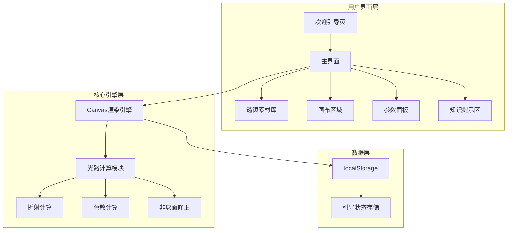
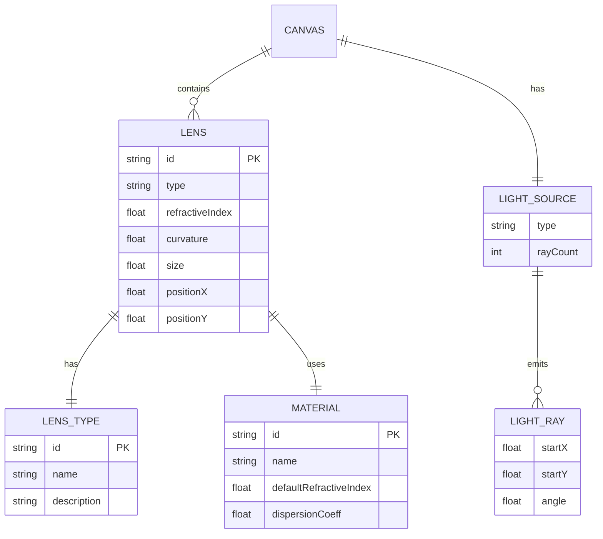
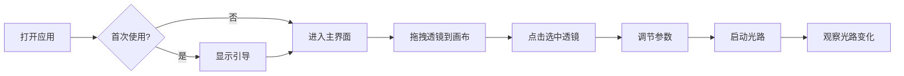

# 中学生交互式光学设计编程项目 - 设计文档

## 一、系统架构



## 二、模块关系图



## 三、核心功能模块

### 3.1 透镜类型与光路规律

| 类型 | 说明 | 光路规律 |
|------|------|----------|
| convex | 凸透镜 | 光线向光轴会聚 |
| concave | 凹透镜 | 光线向外发散 |
| plano | 平面透镜 | 不偏折 |
| aspheric | 非球面透镜 | 精准会聚，消除球差 |

### 3.2 材料类型

| 材料 | 折射率 | 阿贝数 Vd | 说明 |
|------|--------|----------|------|
| normal | 1.5 | 40 | 普通冕牌玻璃，色散较明显 |
| highIndex | 1.7 | 30 | 高折射率火石玻璃，更薄更强聚光，阿贝数小色散明显 |
| lowDispersion | 1.52 | 80 | ED低色散玻璃，阿贝数高，三色几乎重合 |

## 四、UI/UX 规范

### 4.1 色彩体系

- 主色调: #4A90E2 (蓝色)
- 强调色: #5D7A3A (低饱和绿)
- 页面背景: #F5F2EB (浅米白)
- 卡片背景: #FFFFFF
- 主文本: #333333
- 次文本: #666666
- 成功色: #4A5D23
- 错误色: #783F27

### 4.2 字体规范

- 中文: 思源黑体 / 系统默认无衬线体
- 标题: 18-20px, 字重700
- 正文: 14-16px, 字重500
- 辅助文字: 12px, 字重400

### 4.3 间距规范

- 基础单位: 8px
- 小间距: 8px
- 中间距: 16px
- 大间距: 24px
- 卡片圆角: 8px

### 4.4 交互规范

- 可点击区域: ≥44px × 44px (移动端≥48px)
- 过渡动画: 0.3s ease
- 光路更新: 实时

## 五、响应式断点

| 设备 | 断点 | 布局 |
|------|------|------|
| 手机 | <768px | 纵向布局 |
| 平板 | 768px-1024px | 纵向布局 |
| 电脑 | >1024px | 横向布局 |

## 六、文件结构

```
frontend-user/
├── index.html          # 主入口
├── Dockerfile          # Docker配置
├── css/
│   ├── reset.css       # 样式重置
│   ├── variables.css   # CSS变量
│   ├── layout.css      # 布局样式
│   ├── components.css  # 组件样式
│   └── responsive.css  # 响应式样式
└── js/
    ├── app.js          # 应用入口
    ├── config.js       # 配置常量
    ├── storage.js      # 本地存储
    ├── guide.js        # 引导系统
    ├── canvas.js       # 画布管理
    ├── renderer.js     # 光路渲染
    ├── physics.js      # 物理计算
    ├── interaction.js  # 交互处理
    └── utils.js        # 工具函数
```

## 七、核心交互流程



## 八、光路计算原理

### 8.1 核心规律

- 凸透镜：光线向中间会聚（向光轴偏折）
- 凹透镜：光线向外发散（远离光轴）
- 平面透镜：不偏折
- 非球面：消除球差，边缘光线修正

### 8.2 偏折角度计算

统一采用薄透镜光线传递模型（ray transfer），渲染、焦点标注与测验判定共用同一套规律：

```javascript
// 光线用 (x, y, 斜率 u = tanθ) 描述，过透镜时高度 y 不变：
//   u' = u - K(y) · y / f
// f > 0 凸透镜会聚；f < 0 凹透镜发散；f = ∞ 平板不偏折（斜入射仅侧移）
// K(y): 像差系数，球面凸透镜 K = 1 + 球差项 + 斜入射彗差项；非球面 K = 1
```

- 水平入射：各高度光线交于光轴上的焦点 F（f = R/[2(n-1)]）
- 斜入射：过光心的主光线不偏，整束平行光会聚到过 F、垂直于光轴的**焦平面**上
- 球面凸透镜：纵向球差 ∝ ρ⁴（边缘光线前移），斜入射叠加 ∝ sinθ·ρ³ 的彗差样轴外像差
- 非球面：K=1，水平与斜入射光线均精准会聚，可用工具栏"球面/非球面对比"在同光路虚线叠加

### 8.3 入射倾角有效范围

- 工具栏滑块调节平行光倾角（配置范围 -30°~30°）
- 有效范围 = 主光线与 ±75% 口径边缘光线在画布左边缘仍可见的角度交集
- 透镜离左缘越近、口径越大、位置越偏离中心，范围越窄
- 越界立即回退滑块、保留原值并 toast 提示；拖动透镜使原值失效时同样提示

### 8.4 色散模型

以阿贝数 Vd = (nd-1)/(nF-nC) 标定（F=486.1nm 蓝、d=587.6nm 绿、C=656.3nm 红）：

- nF - nC = (nd-1)/Vd，部分色散比取 0.7；蓝光 n 最大、偏折最多，红光最少
- 物理色差很小，画面按统一系数等比放大（仅视觉放大，阿贝数与判定按真实值）
- 水平入射三色焦点沿光轴排开；斜入射同时沿焦平面排开，色散更直观
- Vd=40（普通）与 Vd=30（高折）分离明显，Vd=80（ED）几乎重合，材料规律一眼可见
